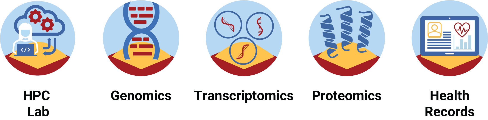

---
# Feel free to add content and custom Front Matter to this file.
# To modify the layout, see https://jekyllrb.com/docs/themes/#overriding-theme-defaults

layout: home
hide:
  - navigation
  - toc
  - footer
---

<h1 align="center" style="margin:0px">Welcome to the Health Data Science Sandbox</h1>
a collaborative project with team members spanning five Danish universities

<figure markdown>
  { width="60%" }
</figure>

The Health Data Science Sandbox is a national project coordinated by the [Center for Health Data Science](https://heads.ku.dk/) at the University of Copenhagen. Advisors and project data scientists are located at five Danish universities. We are building a data science sandbox for students and researchers that contains non-person-sensitive datasets spanning key health data domains - electronic health records, omics data such as genomics and transcriptomics, images, and wearable device data. Datasets are sourced from public databases or generated via privacy-preserving approaches to synthetic health data. Check out our [training modules](https://hds-sandbox.github.com/modules/index.html) that pair topical datasets with recommended analysis tools, pipelines, and learning materials/tutorials in a portable, containerized format.

<figure markdown>
  
</figure>

Our initial aim is to support university courses and programs in health data science and personal medicine, with broader environment access for researchers and university students planned in the future. Our sandbox for exploring health data science techniques will allow low-stakes guided learning and development followed by a smooth transition to a secure environment where users’ knowledge and tools can be applied to sensitive data. The sandbox environment is hosted on Danish supercomputers providing compute power while modules are publicly accessible on [GitHub](https://github.com/hds-sandbox).

Thanks to the Novo Nordisk Foundation for funding the National Health Data Science Project! Please give credit if you use our open-source materials in any form (NNF grant number NNF20OC0063268). 
